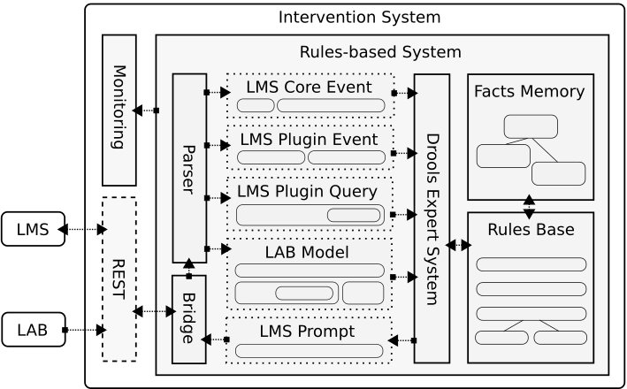

# IKARion XPS Server

## Architecture

## Interfaces

The server accepts HTTP requests, both for data input and for data retrieval. For all requests, the method has to be "POST", content type has to be set to "application/json" and authorization mechanism is "Token".

### Data sources

   * Moodle Event System
   * Learning Analytics Models

### Data retrieval

   * Queries [[link](queries.md)]

# Drools

## Documentation

   * Drools Documentation 7.20.0.Final [[link](https://docs.jboss.org/drools/release/7.20.0.Final/drools-docs/html_single/)]
   * KIE (Knowledge Is Everything) Public API 7.20.0.Final JavaDoc [[link](https://docs.jboss.org/drools/release/7.20.0.Final/kie-api-javadoc/index.html)]

## References

   * Red Hat JBoss BPM Suite Development Guide - Rule Algorithms [[link](https://access.redhat.com/documentation/en-us/red_hat_jboss_bpm_suite/6.4/html-single/development_guide/#chap_rule_algorithms)]
   * Red Hat JBoss BPM Suite Development Guide - Introduction to Complex Event Processing [[link](https://access.redhat.com/documentation/en-us/red_hat_jboss_bpm_suite/6.4/html-single/development_guide/#chap_complex_event_processing)]
   * Red Hat JBoss BPM Suite Development Guide - Getting Started with Rules and Facts [[link](https://access.redhat.com/documentation/en-us/red_hat_jboss_bpm_suite/6.4/html-single/development_guide/#chap_getting_started_with_rules_and_facts)]
   * Red Hat JBoss BPM Suite Development Guide - Working With Rules [[link](https://access.redhat.com/documentation/en-us/red_hat_jboss_bpm_suite/6.4/html-single/development_guide/#chap_working_with_rules)]

# Rule-based Systems

##  Further reading

### Slides

- Modernising Production Rule Systems: OPS, CLIPS, Jess, Drools (2018) [[link](https://decisioncamp2018.files.wordpress.com/2018/09/decisioncamp2018-markproctor.pdf)]
- Drools 6 deep dive (2015) [[link](https://de.slideshare.net/mariofusco/drools-6-deep-dive)]
- JBoss Drools - Pure Java Rule Engine (2014) [[link](https://de.slideshare.net/anilallewar/jboss-drools-37629630)]
- A Rules Engine Experiment: Lessons Learned on When and How to use a Rules-Based Solution (2014) [[link](http://www.asq509.org/ht/a/GetDocumentAction/i/94534)]
- Overview and comparison of expert system shells - Clips, Jess, Drools (2010) [[link](http://home.agh.edu.pl/~ligeza/wiki/_media/ke:ruleinfalg.pdf)]
- Rule-based Systems (2007) [[link](http://www.kr.tuwien.ac.at/education/ewbs_slides/rule-based.pdf)]

### Books

- Knowledge Engineering with Rules (2017) [[link](https://link.springer.com/chapter/10.1007/978-3-319-66655-6_2)]
- Rule Engines, System Control, and System Orchestration (2017) [[link](https://link.springer.com/chapter/10.1007/978-1-4842-1910-2_8)]
- Mastering JBoss Drools 6 (2016) [[link](https://www.scribd.com/document/306932531/Mastering-JBoss-Drools-6-Sample-Chapter)]

## Publications

### 2018

- Runtime evolution for online gaming: A case study using JBoss and Drools [[link](https://research.ncl.ac.uk/game/research/publications/27137d01.pdf)]
- Dynamic Tailoring of RETE Networks in Incremental Scenarios [[link](https://2018.eswc-conferences.org/wp-content/uploads/2018/02/ESWC2018_paper_227.pdf)]

### 2017

- Fault Tolerance Using an SDN Pattern Framework [[link](http://openaccess.city.ac.uk/17901/)]
- Using a Knowledge Based System for Automatic Site Equipment Planning [[link](https://www.cms.bgu.tum.de/publications/2017_Jahr_EG-ICE.pdf)]

### 2016

- Comparing Drools and Ontology Reasoning Approaches for Automated Monitoring in Telecommunication Processes [[link](https://www.sciencedirect.com/science/article/pii/S1877050916325182)]
- Comparison of the performance of Drools and Jena rule-based systems for event processing on the semantic web [[link](https://ieeexplore.ieee.org/abstract/document/7516153/)]
- The G-ACM Tool:  using the Drools Rule Engine for Access Control Management [[link](https://arxiv.org/pdf/1611.08547.pdf)]

### 2015

- Indexing RETE’s Working Memory [[link](http://www.guidosalvaneschi.com/REBLS/REBLS2015/attachments/REBLS15_paper_9.pdf)]

### 2014

- A mechanism to enable spatial reasoning in JBoss Drools [[link](https://ieeexplore.ieee.org/abstract/document/6922091/)]

### 2013

- Towards Rule Interoperability: Design of Drools Rule Bases Using the XTT2 Method [[link](https://link.springer.com/chapter/10.1007%2F978-3-642-41776-4_7)]
- FlowOps: Open Access Network Management and Operation [[link](https://www.flux.utah.edu/download?uid=168)]

### 2012

- Modeling and Executing Electronic Health Records Driven Phenotyping Algorithms using the NQF Quality Data Model and JBoss Drools Engine [[link](https://www.ncbi.nlm.nih.gov/pmc/articles/PMC3540464/)]
- Comparing Drools and ontology reasoning approaches for telecardiology decision support [[link](https://www.researchgate.net/profile/Olivier_Dameron/publication/230637406_Comparing_Drools_and_ontology_reasoning_approaches_for_telecardiology_decision_support/links/0deec52fb4b6f882ec000000.pdf)]

### 2011

- KnowOps: Towards an Embedded Knowledge Base for Network Management and Operations [[link](http://static.usenix.org/event/hotice11/tech/full_papers/Chen.pdf)]
- Rules-based analysis with JBoss Drools: adding intelligence to automation [[link](http://accelconf.web.cern.ch/accelconf/icalepcs2011/papers/wepks008.pdf)]
- Rule based programming with Drools [[link](http://ijcsit.com/docs/Volume%202/vol2issue3/ijcsit2011020335.pdf)]
- Drools: A Rule Engine for Complex Event Processing [[link](https://www.researchgate.net/publication/262174358_Drools_A_Rule_Engine_for_Complex_Event_Processing)]

### 2009

- An Automatically Composable OWL Reasoner for Resource Constrained Devices [[link](http://www.tara.tcd.ie/bitstream/handle/2262/38086/icsc09_tai.pdf?sequence=1&isAllowed=y)]
- Application of drools in network fault management system [[link](http://en.cnki.com.cn/Article_en/CJFDTotal-SJSJ200908015.htm)]
- Off-line Analysis Research and Implementation Based on Drools [[link](http://en.cnki.com.cn/Article_en/CJFDTOTAL-WJSJ200903063.htm)]

### 2008

- On Interchange between Drools and Jess [[link](http://www.informatica.si/index.php/informatica/article/viewFile/211/208)]

